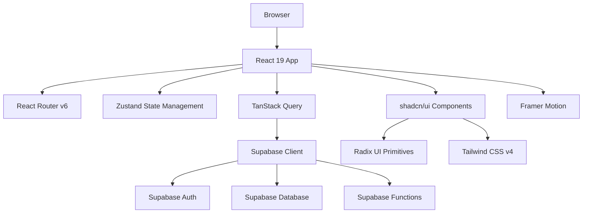

# Documento de Diseño: Modernización UI/UX del Professional Portal

## Resumen Ejecutivo

El Professional Portal de MacroTracker es actualmente una aplicación web estática (HTML/CSS/JavaScript vanilla) que requiere una modernización significativa para alcanzar estándares profesionales y equipararse con la experiencia de usuario de la aplicación Flutter MacroTracker. Este documento detalla el diseño técnico para transformar el portal en una aplicación web moderna, escalable y profesional utilizando tecnologías de vanguardia.

## Visión General

### Objetivos del Proyecto

1. **Modernizar la arquitectura frontend** migrando de JavaScript vanilla a un framework moderno
2. **Implementar un sistema de diseño coherente** alineado con la aplicación Flutter MacroTracker
3. **Mejorar la experiencia de usuario** con interfaces profesionales, animaciones fluidas y feedback visual
4. **Optimizar el rendimiento** reduciendo tamaño de bundle y tiempo de carga
5. **Establecer fundamentos escalables** para futuras funcionalidades del portal B2B

### Estado Actual

**Arquitectura Actual:**
- HTML/CSS/JavaScript vanilla
- Supabase Client para autenticación y backend
- Sin sistema de componentes reutilizables
- Sin gestión de estado centralizada
- Estilos CSS globales con variables CSS personalizadas

**Limitaciones Identificadas:**
- Código difícil de mantener sin componentización
- Sin sistema de diseño definido
- Experiencia de usuario básica sin transiciones ni microinteracciones
- Falta de accesibilidad (ARIA, navegación por teclado)
- Sin sistema de testing
- Bundle único sin code-splitting

## Decisión Técnica: Selección de Framework

### Análisis de Frameworks Modernos

Basado en la investigación de frameworks modernos en 2024-2025, se evaluaron tres opciones principales:


| Framework | Bundle Size | Rendering Speed | Ecosystem | Learning Curve | Recomendación |
|-----------|-------------|-----------------|-----------|----------------|---------------|
| **React 19** | ~42 KB (Hello World) | 1-2 segundos (promedio) | Más amplio y maduro | Moderada | ✅ **Recomendado** |
| **Vue 3** | ~20 KB (Hello World) | 1-2 segundos (promedio) | Maduro y completo | Baja | ⭐ Alternativa sólida |
| **Svelte 5** | ~1.6 KB (Hello World) | 110 ms (mejor de su clase) | En crecimiento | Baja | ⚠️ Ecosistema limitado |

### Recomendación Final: **React 19 + TypeScript + Vite**

**Justificación:**

1. **Ecosistema maduro**: Biblioteca más amplia de componentes, herramientas y documentación
2. **Integración con Supabase**: Supabase tiene soporte oficial y ejemplos extensos con React
3. **Talento disponible**: Mayor facilidad para encontrar desarrolladores con experiencia
4. **Compatibilidad futura**: Preparación para Server Components y React Server Actions si se necesitan
5. **TypeScript**: Seguridad de tipos y mejor experiencia de desarrollo
6. **Vite**: Build tool moderno con HMR instantáneo y bundle optimizado

**Alternativa considerada**: Vue 3 es una excelente opción si se prefiere una curva de aprendizaje más suave y bundle size más pequeño. Svelte 5 ofrece el mejor rendimiento pero tiene un ecosistema más limitado para necesidades B2B empresariales.

## Sistema de Diseño

### Inspiración: MacroTracker Flutter App

El portal web debe reflejar la identidad visual de la aplicación Flutter MacroTracker:

**Colores Base (Material Theme Builder):**

```typescript
// theme/colors.ts
export const colors = {
  light: {
    primary: '#0F7A3F',
    onPrimary: '#FFFFFF',
    primaryContainer: '#DDF8E7',
    onPrimaryContainer: '#062915',
    secondary: '#59645A',
    onSecondary: '#FFFFFF',
    secondaryContainer: '#E3EBE1',
    onSecondaryContainer: '#171F18',

    surface: '#FAFBF7',
    onSurface: '#171A17',
    surfaceContainerHighest: '#E4E8E1',
    error: '#B3261E',
    outline: '#757D75',
  },
  dark: {
    primary: '#72DE98',
    onPrimary: '#062713',
    primaryContainer: '#124D2A',
    onPrimaryContainer: '#DDF8E7',
    secondary: '#9CA3AF',
    onSecondary: '#1F2937',
    secondaryContainer: '#2D2D2D',
    onSecondaryContainer: '#F3F4F6',
    surface: '#080808',
    onSurface: '#F3F4F6',
    surfaceContainerHighest: '#1A1A1A',
    error: '#FFB4AB',
    outline: '#4B5563',
  }
}
```

**Tipografía:**
- Font Family: `Poppins` (consistente con la app Flutter)
- Escala tipográfica Material Design 3

### Selección de Sistema de Componentes: **shadcn/ui + Tailwind CSS v4**

**Justificación:**

1. **Propiedad del código**: Los componentes se copian al proyecto (no son una dependencia externa)
2. **Personalización completa**: Fácil adaptación a la identidad de MacroTracker
3. **Accesibilidad integrada**: Construido sobre Radix UI con soporte ARIA completo
4. **Tailwind CSS v4**: Utility-first con nueva arquitectura de performance
5. **Compatibilidad con design tokens**: Fácil mapeo de colores Material a Tailwind

**Alternativas consideradas:**
- Material UI (React): Más pesado, difícil de personalizar, no coincide con el diseño actual
- Ant Design: Estilo corporativo asiático, no alineado con identidad MacroTracker
- Chakra UI: Buena opción pero menos momentum que shadcn/ui en 2024-2025


## Arquitectura de la Aplicación



### Capas de la Arquitectura

**1. Capa de Presentación**
- Componentes React funcionales con hooks
- shadcn/ui para componentes base
- Tailwind CSS v4 para estilos
- Framer Motion para animaciones

**2. Capa de Lógica de Negocio**
- Custom hooks para lógica reutilizable
- TanStack Query para gestión de server state
- Zustand para client state (UI, theme, auth session)

**3. Capa de Datos**
- Supabase Client SDK
- Type-safe queries con TypeScript
- Real-time subscriptions para mensajería
- Row Level Security (RLS) enforcement

**4. Capa de Routing**
- React Router v6 con lazy loading
- Rutas protegidas con auth guards
- Code-splitting por ruta


## Estructura de Proyecto

```
professional-portal-react/
├── public/
│   ├── favicon.ico
│   └── manifest.json
├── src/
│   ├── components/
│   │   ├── ui/              # shadcn/ui components
│   │   │   ├── button.tsx
│   │   │   ├── card.tsx
│   │   │   ├── input.tsx
│   │   │   ├── badge.tsx
│   │   │   ├── dialog.tsx
│   │   │   └── ...
│   │   ├── auth/
│   │   │   ├── LoginForm.tsx
│   │   │   └── MagicLinkSent.tsx
│   │   ├── layout/
│   │   │   ├── Sidebar.tsx
│   │   │   ├── Header.tsx
│   │   │   └── AppShell.tsx
│   │   ├── profile/
│   │   │   ├── ProfileCard.tsx
│   │   │   ├── ProfileForm.tsx
│   │   │   └── ProStatusBadge.tsx
│   │   ├── billing/
│   │   │   ├── TierCard.tsx
│   │   │   └── BillingPanel.tsx
│   │   ├── clients/
│   │   │   ├── ClientCard.tsx
│   │   │   ├── ClientList.tsx
│   │   │   ├── ClientDetail.tsx
│   │   │   ├── SnapshotCard.tsx
│   │   │   └── ChatPanel.tsx
│   │   ├── invites/
│   │   │   └── InviteGenerator.tsx
│   │   └── plans/
│   │       └── PlanBuilder.tsx
│   ├── pages/
│   │   ├── LoginPage.tsx
│   │   ├── DashboardPage.tsx
│   │   ├── ProfilePage.tsx
│   │   ├── BillingPage.tsx
│   │   ├── ClientsPage.tsx
│   │   └── ClientDetailPage.tsx
│   ├── hooks/
│   │   ├── useAuth.ts
│   │   ├── useProfessional.ts
│   │   ├── useClients.ts
│   │   ├── useInvites.ts
│   │   ├── usePlans.ts
│   │   └── useMessages.ts
│   ├── lib/
│   │   ├── supabase.ts        # Supabase client setup
│   │   └── utils.ts           # Utility functions
│   ├── store/
│   │   ├── authStore.ts       # Zustand auth store
│   │   └── themeStore.ts      # Zustand theme store
│   ├── types/
│   │   ├── database.types.ts  # Supabase generated types
│   │   └── index.ts
│   ├── theme/
│   │   ├── colors.ts
│   │   └── tailwind.config.ts
│   ├── App.tsx
│   ├── main.tsx
│   └── vite-env.d.ts
├── .env.example
├── .env.local
├── package.json
├── tsconfig.json
├── tailwind.config.ts
├── postcss.config.js
├── vite.config.ts
└── README.md
```


## Componentes e Interfaces

### 1. Sistema de Autenticación

#### LoginForm Component

```typescript
// src/components/auth/LoginForm.tsx
interface LoginFormProps {
  onSuccess?: () => void;
  onError?: (error: Error) => void;
}

const LoginForm: React.FC<LoginFormProps> = ({ onSuccess, onError }) => {
  const [email, setEmail] = useState('');
  const [isLoading, setIsLoading] = useState(false);
  const { signInWithMagicLink } = useAuth();

  const handleSubmit = async (e: FormEvent) => {
    e.preventDefault();
    setIsLoading(true);
    try {
      await signInWithMagicLink(email);
      onSuccess?.();
    } catch (error) {
      onError?.(error as Error);
    } finally {
      setIsLoading(false);
    }
  };

  return (
    <form onSubmit={handleSubmit} className="space-y-4">
      <Input
        type="email"
        value={email}
        onChange={(e) => setEmail(e.target.value)}
        placeholder="nutritionist@example.com"
        required
      />
      <Button type="submit" disabled={isLoading} className="w-full">
        {isLoading ? 'Enviando...' : 'Enviar magic link'}
      </Button>
    </form>
  );
};
```

**Especificaciones Formales:**

**Precondiciones:**
- `email` debe ser una cadena no vacía
- `email` debe tener formato válido de email (regex: `^[^\s@]+@[^\s@]+\.[^\s@]+$`)

**Postcondiciones:**
- Si exitoso: `onSuccess()` es invocado y el usuario recibe un email con magic link
- Si error: `onError(error)` es invocado con el error capturado
- `isLoading` siempre retorna a `false` después de la operación


### 2. Layout y Navegación

#### Sidebar Component

```typescript
// src/components/layout/Sidebar.tsx
interface SidebarProps {
  isOpen?: boolean;
  onClose?: () => void;
}

interface NavigationItem {
  id: string;
  label: string;
  icon: React.ReactNode;
  href: string;
  badge?: number;
}

const Sidebar: React.FC<SidebarProps> = ({ isOpen = true, onClose }) => {
  const location = useLocation();
  const { professional } = useProfessional();
  
  const navItems: NavigationItem[] = [
    { id: 'profile', label: 'Perfil', icon: <User />, href: '/profile' },
    { id: 'billing', label: 'Facturación', icon: <CreditCard />, href: '/billing' },
    { id: 'invites', label: 'Invitaciones', icon: <Mail />, href: '/invites' },
    { id: 'clients', label: 'Clientes', icon: <Users />, href: '/clients', badge: unreadCount },
    { id: 'plans', label: 'Planes', icon: <FileText />, href: '/plans' },
  ];

  return (
    <aside className="sidebar">
      <div className="brand-lockup">
        <div className="brand-mark">MT</div>
        <div>
          <p className="eyebrow">MacroTracker</p>
          <h1>Pro Portal</h1>
        </div>
      </div>
      
      <nav className="nav-list">
        {navItems.map((item) => (
          <NavLink
            key={item.id}
            to={item.href}
            className={({ isActive }) => 
              cn('nav-item', isActive && 'nav-item-active')
            }
          >
            {item.icon}
            <span>{item.label}</span>
            {item.badge && <Badge variant="error">{item.badge}</Badge>}
          </NavLink>
        ))}
      </nav>
      
      <div className="sidebar-footer">
        <StatusIndicator status="active" />
        <span>Private professional release</span>
      </div>
    </aside>
  );
};
```


### 3. Gestión de Clientes

#### ClientCard Component

```typescript
// src/components/clients/ClientCard.tsx
interface ClientCardProps {
  client: {
    id: string;
    client_id: string;
    status: string;
    connected_at: string;
    latest_snapshot?: {
      snapshot_date: string;
      kcal_actual: number;
      kcal_target: number;
    };
    unread_messages: number;
  };
  onSelect: () => void;
}

const ClientCard: React.FC<ClientCardProps> = ({ client, onSelect }) => {
  return (
    <Card className="client-card" onClick={onSelect}>
      <CardHeader>
        <div className="flex items-center justify-between">
          <CardTitle>{client.client_id}</CardTitle>
          {client.unread_messages > 0 && (
            <Badge variant="destructive">{client.unread_messages} nuevos</Badge>
          )}
        </div>
        <CardDescription>
          {client.status} · {formatDate(client.connected_at)}
        </CardDescription>
      </CardHeader>
      
      {client.latest_snapshot && (
        <CardContent>
          <div className="snapshot-summary">
            <span className="text-muted-foreground">
              {client.latest_snapshot.snapshot_date}:
            </span>
            <span className="font-semibold">
              {Math.round(client.latest_snapshot.kcal_actual)} / 
              {Math.round(client.latest_snapshot.kcal_target)} kcal
            </span>
          </div>
        </CardContent>
      )}
      
      <CardFooter>
        <Button variant="ghost" className="w-full">
          Ver Cliente
        </Button>
      </CardFooter>
    </Card>
  );
};
```

**Especificaciones Formales:**

**Precondiciones:**
- `client.id` debe ser un UUID válido
- `client.client_id` debe ser una cadena no vacía
- `client.connected_at` debe ser una fecha ISO 8601 válida

**Postcondiciones:**
- Al hacer click: `onSelect()` es invocado
- Badge de mensajes no leídos solo se muestra si `unread_messages > 0`
- Latest snapshot solo se renderiza si `latest_snapshot` existe


### 4. Sistema de Mensajería en Tiempo Real

#### ChatPanel Component

```typescript
// src/components/clients/ChatPanel.tsx
interface Message {
  id: string;
  body: string;
  author_role: 'professional' | 'client';
  created_at: string;
  professional_read_at?: string;
}

interface ChatPanelProps {
  relationshipId: string;
  clientId: string;
}

const ChatPanel: React.FC<ChatPanelProps> = ({ relationshipId, clientId }) => {
  const messagesEndRef = useRef<HTMLDivElement>(null);
  const [messageInput, setMessageInput] = useState('');
  
  const { data: messages, isLoading } = useMessages(relationshipId);
  const sendMessageMutation = useSendMessage();
  const markAsReadMutation = useMarkMessagesAsRead();

  useEffect(() => {
    if (messages && messages.length > 0) {
      messagesEndRef.current?.scrollIntoView({ behavior: 'smooth' });
      
      const unreadMessages = messages.filter(
        m => m.author_role === 'client' && !m.professional_read_at
      );
      
      if (unreadMessages.length > 0) {
        markAsReadMutation.mutate(unreadMessages.map(m => m.id));
      }
    }
  }, [messages]);

  const handleSendMessage = async () => {
    if (!messageInput.trim()) return;
    
    await sendMessageMutation.mutateAsync({
      relationshipId,
      clientId,
      body: messageInput.trim(),
    });
    
    setMessageInput('');
  };

  return (
    <Card className="chat-panel">
      <CardHeader>
        <CardTitle>Mensajes del Cliente</CardTitle>
      </CardHeader>
      
      <CardContent className="chat-messages">
        {isLoading && <Skeleton count={3} />}
        
        {messages?.map((message) => (
          <div
            key={message.id}
            className={cn(
              'chat-message',
              message.author_role === 'professional' 
                ? 'chat-message-self' 
                : 'chat-message-client'
            )}
          >
            <p className="message-body">{message.body}</p>
            <small className="message-time">
              {formatDateTime(message.created_at)}
            </small>
          </div>
        ))}
        
        <div ref={messagesEndRef} />
      </CardContent>
      
      <CardFooter className="chat-input-area">
        <Input
          value={messageInput}
          onChange={(e) => setMessageInput(e.target.value)}
          onKeyPress={(e) => e.key === 'Enter' && handleSendMessage()}
          placeholder="Escribe un mensaje a tu cliente..."
        />
        <Button onClick={handleSendMessage}>
          <Send className="w-4 h-4" />
        </Button>
      </CardFooter>
    </Card>
  );
};
```


**Especificaciones Formales:**

**Precondiciones:**
- `relationshipId` debe ser un UUID válido de la relación professional-client
- `clientId` debe ser un string no vacío identificando al cliente

**Postcondiciones:**
- Mensajes se ordenan cronológicamente ascendente
- Auto-scroll al último mensaje cuando se carga el chat o llega mensaje nuevo
- Mensajes no leídos del cliente se marcan como leídos automáticamente al visualizarse
- `messageInput` se limpia después de envío exitoso
- Enter key envía el mensaje (además del botón)

**Loop Invariants:**
- Todos los mensajes no leídos del cliente (`author_role === 'client' && !professional_read_at`) se marcan como leídos al montarse el componente

## Hooks Personalizados

### useAuth Hook

```typescript
// src/hooks/useAuth.ts
interface UseAuthReturn {
  session: Session | null;
  user: User | null;
  isLoading: boolean;
  signInWithMagicLink: (email: string) => Promise<void>;
  signOut: () => Promise<void>;
}

export const useAuth = (): UseAuthReturn => {
  const [session, setSession] = useState<Session | null>(null);
  const [user, setUser] = useState<User | null>(null);
  const [isLoading, setIsLoading] = useState(true);
  const supabase = useSupabaseClient();

  useEffect(() => {
    // Get initial session
    supabase.auth.getSession().then(({ data: { session } }) => {
      setSession(session);
      setUser(session?.user ?? null);
      setIsLoading(false);
    });

    // Listen for auth changes
    const {
      data: { subscription },
    } = supabase.auth.onAuthStateChange((_event, session) => {
      setSession(session);
      setUser(session?.user ?? null);
    });

    return () => subscription.unsubscribe();
  }, [supabase]);

  const signInWithMagicLink = async (email: string) => {
    const { error } = await supabase.auth.signInWithOtp({
      email,
      options: {
        emailRedirectTo: window.location.origin,
      },
    });
    if (error) throw error;
  };

  const signOut = async () => {
    const { error } = await supabase.auth.signOut();
    if (error) throw error;
  };

  return { session, user, isLoading, signInWithMagicLink, signOut };
};
```


### useProfessional Hook con TanStack Query

```typescript
// src/hooks/useProfessional.ts
interface Professional {
  id: string;
  user_id: string;
  display_name: string;
  business_name: string;
  pro_status: 'inactive' | 'trialing' | 'active' | 'past_due' | 'canceled';
  client_limit: number;
}

export const useProfessional = () => {
  const { user } = useAuth();
  
  const query = useQuery({
    queryKey: ['professional', user?.id],
    queryFn: async () => {
      if (!user) return null;
      
      const { data, error } = await supabase
        .from('professionals')
        .select('*')
        .eq('user_id', user.id)
        .maybeSingle();
      
      if (error) throw error;
      return data as Professional | null;
    },
    enabled: !!user,
  });

  const updateMutation = useMutation({
    mutationFn: async (updates: Partial<Professional>) => {
      if (!user) throw new Error('No user logged in');
      
      const { data, error } = await supabase
        .from('professionals')
        .upsert(
          { user_id: user.id, ...updates },
          { onConflict: 'user_id' }
        )
        .select()
        .single();
      
      if (error) throw error;
      return data as Professional;
    },
    onSuccess: () => {
      queryClient.invalidateQueries({ queryKey: ['professional', user?.id] });
    },
  });

  return {
    professional: query.data,
    isLoading: query.isLoading,
    error: query.error,
    updateProfessional: updateMutation.mutateAsync,
    isUpdating: updateMutation.isPending,
  };
};
```

**Especificaciones Formales:**

**Precondiciones:**
- `user` debe estar autenticado para ejecutar la query
- `updates` en `updateProfessional` debe contener al menos un campo válido

**Postcondiciones:**
- `professional` es `null` si no existe registro o usuario no autenticado
- `updateProfessional` invalida cache y refetch automático después de mutación exitosa
- Errores de Supabase se propagan como excepciones


## Modelos de Datos

### Professional Model

```typescript
// src/types/index.ts
export interface Professional {
  id: string;
  user_id: string;
  display_name: string;
  business_name: string;
  pro_status: ProStatus;
  client_limit: number;
  created_at: string;
  updated_at: string;
}

export type ProStatus = 
  | 'inactive' 
  | 'trialing' 
  | 'active' 
  | 'past_due' 
  | 'canceled';

export const isProActive = (status: ProStatus): boolean => {
  return ['trialing', 'active'].includes(status);
};
```

**Reglas de Validación:**
- `display_name`: requerido, min 2 caracteres, max 100 caracteres
- `business_name`: opcional, max 150 caracteres
- `pro_status`: debe ser uno de los valores del enum ProStatus
- `client_limit`: número entero >= 0

### Client Relationship Model

```typescript
export interface ClientRelationship {
  id: string;
  professional_id: string;
  client_id: string;
  status: 'pending' | 'connected' | 'disconnected';
  connected_at: string;
  sharing_mode: 'aggregate_only' | 'full_access';
  messages_enabled: boolean;
  snapshots: ClientSnapshot[];
  unread_messages_count: number;
}

export interface ClientSnapshot {
  id: string;
  professional_client_id: string;
  snapshot_date: string;
  kcal_actual: number;
  kcal_target: number;
  protein_actual: number;
  protein_target: number;
  carbs_actual: number;
  carbs_target: number;
  fat_actual: number;
  fat_target: number;
  created_at: string;
}
```

**Reglas de Validación:**
- `client_id`: requerido, debe corresponder a un usuario válido en la app móvil
- `status`: debe ser uno de 'pending' | 'connected' | 'disconnected'
- Todos los campos numéricos de macros deben ser >= 0


### Nutrition Plan Model

```typescript
export interface NutritionPlan {
  id: string;
  professional_id: string;
  client_id: string;
  name: string;
  objective: 'general_fitness' | 'muscle_gain' | 'weight_loss' | 'maintenance';
  status: 'active' | 'inactive' | 'completed';
  days: NutritionPlanDay[];
  created_at: string;
  updated_at: string;
}

export interface NutritionPlanDay {
  id: string;
  plan_id: string;
  weekday: 1 | 2 | 3 | 4 | 5 | 6 | 7;
  kcal_goal: number;
  protein_goal: number;
  carbs_goal: number;
  fat_goal: number;
}
```

**Reglas de Validación:**
- `name`: requerido, min 3 caracteres, max 100 caracteres
- `weekday`: debe ser entero entre 1 (lunes) y 7 (domingo)
- Todas las metas de macros (`*_goal`) deben ser > 0
- Un plan debe tener exactamente 7 días (uno por cada día de la semana)

## Manejo de Errores

### Error Boundary Component

```typescript
// src/components/ErrorBoundary.tsx
interface ErrorBoundaryState {
  hasError: boolean;
  error: Error | null;
}

class ErrorBoundary extends React.Component<
  { children: React.ReactNode },
  ErrorBoundaryState
> {
  constructor(props: { children: React.ReactNode }) {
    super(props);
    this.state = { hasError: false, error: null };
  }

  static getDerivedStateFromError(error: Error): ErrorBoundaryState {
    return { hasError: true, error };
  }

  componentDidCatch(error: Error, errorInfo: React.ErrorInfo) {
    console.error('ErrorBoundary caught:', error, errorInfo);
    // Opcional: enviar a servicio de logging (Sentry)
  }

  render() {
    if (this.state.hasError) {
      return (
        <div className="error-fallback">
          <h2>Algo salió mal</h2>
          <p>{this.state.error?.message}</p>
          <Button onClick={() => window.location.reload()}>
            Recargar página
          </Button>
        </div>
      );
    }

    return this.props.children;
  }
}
```


### Escenarios de Error y Recuperación

#### Error Scenario 1: Fallo de Autenticación

**Condición**: Magic link inválido o expirado
**Respuesta**: Mostrar toast con mensaje de error claro
**Recuperación**: Permitir reenvío de magic link con nuevo intento

#### Error Scenario 2: Fallo de Conexión a Supabase

**Condición**: Red inestable o Supabase caído
**Respuesta**: TanStack Query reintenta automáticamente (3 intentos con backoff exponencial)
**Recuperación**: Mostrar estado de loading persistente, luego mensaje de error si todos los reintentos fallan

#### Error Scenario 3: Operación de Base de Datos Fallida

**Condición**: RLS policy bloquea operación o constraint violation
**Respuesta**: Capturar error de Supabase, extraer mensaje legible
**Recuperación**: Mostrar toast con mensaje de error, no mutar estado local

#### Error Scenario 4: Stripe Checkout Fallido

**Condición**: Stripe API no responde o checkout session inválida
**Respuesta**: Mostrar dialog modal con detalles del error
**Recuperación**: Botón para reintentar checkout o contactar soporte

## Estrategia de Testing

### Unit Testing

**Framework**: Vitest + Testing Library

**Cobertura de Pruebas:**
- Componentes UI individuales (Button, Card, Input, etc.)
- Custom hooks (useAuth, useProfessional, useClients)
- Utility functions (formatters, validators)
- Store logic (Zustand actions)

**Ejemplo de Test:**

```typescript
// src/components/auth/__tests__/LoginForm.test.tsx
import { render, screen, fireEvent, waitFor } from '@testing-library/react';
import { LoginForm } from '../LoginForm';

describe('LoginForm', () => {
  it('should render email input and submit button', () => {
    render(<LoginForm />);
    expect(screen.getByPlaceholderText('nutritionist@example.com')).toBeInTheDocument();
    expect(screen.getByRole('button', { name: /enviar magic link/i })).toBeInTheDocument();
  });

  it('should disable submit button when loading', async () => {
    const mockSignIn = vi.fn(() => Promise.resolve());
    render(<LoginForm onSubmit={mockSignIn} />);
    
    const input = screen.getByPlaceholderText('nutritionist@example.com');
    const button = screen.getByRole('button', { name: /enviar magic link/i });
    
    fireEvent.change(input, { target: { value: 'test@example.com' } });
    fireEvent.click(button);
    
    expect(button).toBeDisabled();
    await waitFor(() => expect(button).not.toBeDisabled());
  });

  it('should call onSuccess callback when sign in succeeds', async () => {
    const mockOnSuccess = vi.fn();
    const mockSignIn = vi.fn(() => Promise.resolve());
    
    render(<LoginForm onSuccess={mockOnSuccess} />);
    
    const input = screen.getByPlaceholderText('nutritionist@example.com');
    const button = screen.getByRole('button', { name: /enviar magic link/i });
    
    fireEvent.change(input, { target: { value: 'test@example.com' } });
    fireEvent.click(button);
    
    await waitFor(() => expect(mockOnSuccess).toHaveBeenCalledTimes(1));
  });
});
```


### Integration Testing

**Framework**: Playwright (E2E)

**Cobertura de Flujos:**
- Login flow completo (magic link)
- Profile creation y update
- Client invitation flow
- Plan creation y asignación
- Client detail view y messaging

**Ejemplo de Test E2E:**

```typescript
// e2e/auth.spec.ts
import { test, expect } from '@playwright/test';

test.describe('Authentication Flow', () => {
  test('should login with magic link', async ({ page }) => {
    await page.goto('http://localhost:5173');
    
    // Fill email and submit
    await page.fill('input[type="email"]', 'test@example.com');
    await page.click('button:has-text("Enviar magic link")');
    
    // Check success message
    await expect(page.locator('text=Magic link enviado')).toBeVisible();
    
    // Simulate clicking magic link (requires test helper endpoint)
    // ...
  });

  test('should show dashboard after login', async ({ page, context }) => {
    // Pre-authenticate context
    await context.addCookies([/* auth cookies */]);
    
    await page.goto('http://localhost:5173/dashboard');
    
    // Verify dashboard elements
    await expect(page.locator('h2:has-text("Client plans")')).toBeVisible();
    await expect(page.locator('nav a:has-text("Clientes")')).toBeVisible();
  });
});
```

### Property-Based Testing

**Biblioteca**: fast-check

**Casos de Uso:**
- Validación de email en diferentes formatos
- Validación de macros goals (siempre > 0)
- Formateo de fechas con diferentes locales

**Ejemplo:**

```typescript
// src/lib/__tests__/validators.test.ts
import fc from 'fast-check';
import { validateMacroGoals } from '../validators';

describe('validateMacroGoals - Property Tests', () => {
  it('should accept all positive numbers', () => {
    fc.assert(
      fc.property(
        fc.integer({ min: 1, max: 10000 }),
        fc.integer({ min: 1, max: 500 }),
        fc.integer({ min: 1, max: 1000 }),
        fc.integer({ min: 1, max: 500 }),
        (kcal, protein, carbs, fat) => {
          const result = validateMacroGoals({ kcal, protein, carbs, fat });
          expect(result.valid).toBe(true);
        }
      )
    );
  });

  it('should reject any zero or negative values', () => {
    fc.assert(
      fc.property(
        fc.integer({ max: 0 }),
        (invalidValue) => {
          const result = validateMacroGoals({
            kcal: invalidValue,
            protein: 100,
            carbs: 200,
            fat: 50,
          });
          expect(result.valid).toBe(false);
        }
      )
    );
  });
});
```


## Consideraciones de Performance

### Optimizaciones Implementadas

**1. Code Splitting por Ruta**

```typescript
// src/App.tsx
import { lazy, Suspense } from 'react';

const DashboardPage = lazy(() => import('./pages/DashboardPage'));
const ClientsPage = lazy(() => import('./pages/ClientsPage'));
const BillingPage = lazy(() => import('./pages/BillingPage'));

function App() {
  return (
    <Routes>
      <Route path="/" element={
        <Suspense fallback={<LoadingSpinner />}>
          <DashboardPage />
        </Suspense>
      } />
      <Route path="/clients" element={
        <Suspense fallback={<LoadingSpinner />}>
          <ClientsPage />
        </Suspense>
      } />
      <Route path="/billing" element={
        <Suspense fallback={<LoadingSpinner />}>
          <BillingPage />
        </Suspense>
      } />
    </Routes>
  );
}
```

**2. Image Optimization**

- Usar formato WebP con fallback a PNG/JPG
- Lazy loading de imágenes con `loading="lazy"`
- Responsive images con srcset

**3. TanStack Query Cache Management**

```typescript
// src/lib/queryClient.ts
export const queryClient = new QueryClient({
  defaultOptions: {
    queries: {
      staleTime: 1000 * 60 * 5, // 5 minutos
      gcTime: 1000 * 60 * 30, // 30 minutos (anteriormente cacheTime)
      retry: 3,
      retryDelay: (attemptIndex) => Math.min(1000 * 2 ** attemptIndex, 30000),
    },
  },
});
```

**4. Debouncing de Search Inputs**

```typescript
// src/hooks/useDebounce.ts
export const useDebounce = <T,>(value: T, delay: number = 300): T => {
  const [debouncedValue, setDebouncedValue] = useState(value);

  useEffect(() => {
    const handler = setTimeout(() => {
      setDebouncedValue(value);
    }, delay);

    return () => clearTimeout(handler);
  }, [value, delay]);

  return debouncedValue;
};
```

**5. Memoización de Componentes Pesados**

```typescript
// src/components/clients/ClientList.tsx
export const ClientList = memo(({ clients }: { clients: Client[] }) => {
  return (
    <div className="client-list">
      {clients.map((client) => (
        <ClientCard key={client.id} client={client} />
      ))}
    </div>
  );
}, (prevProps, nextProps) => {
  // Custom comparison: solo re-render si los IDs cambian
  return (
    prevProps.clients.length === nextProps.clients.length &&
    prevProps.clients.every((c, i) => c.id === nextProps.clients[i].id)
  );
});
```

### Métricas de Performance Objetivo

| Métrica | Objetivo | Método de Medición |
|---------|----------|-------------------|
| **First Contentful Paint (FCP)** | < 1.5s | Lighthouse |
| **Largest Contentful Paint (LCP)** | < 2.5s | Lighthouse |
| **Time to Interactive (TTI)** | < 3.5s | Lighthouse |
| **Cumulative Layout Shift (CLS)** | < 0.1 | Lighthouse |
| **Total Bundle Size** | < 150 KB (gzipped) | Vite build analysis |
| **API Response Time** | < 200ms (p95) | Supabase monitoring |


## Consideraciones de Seguridad

### Autenticación y Autorización

**1. Supabase Row Level Security (RLS)**

Todas las tablas deben tener políticas RLS habilitadas:

```sql
-- Ejemplo: professionals table RLS
ALTER TABLE professionals ENABLE ROW LEVEL SECURITY;

CREATE POLICY "Professionals can view own profile"
ON professionals FOR SELECT
USING (auth.uid() = user_id);

CREATE POLICY "Professionals can update own profile"
ON professionals FOR UPDATE
USING (auth.uid() = user_id);

-- Ejemplo: professional_clients table RLS
CREATE POLICY "Professionals can view own clients"
ON professional_clients FOR SELECT
USING (
  EXISTS (
    SELECT 1 FROM professionals
    WHERE professionals.id = professional_clients.professional_id
    AND professionals.user_id = auth.uid()
  )
);
```

**2. Validación de Entrada**

```typescript
// src/lib/validators.ts
import { z } from 'zod';

export const professionalProfileSchema = z.object({
  display_name: z.string().min(2).max(100),
  business_name: z.string().max(150).optional(),
});

export const nutritionPlanSchema = z.object({
  name: z.string().min(3).max(100),
  kcal_goal: z.number().positive().int(),
  protein_goal: z.number().positive().int(),
  carbs_goal: z.number().positive().int(),
  fat_goal: z.number().positive().int(),
});

// Uso en componente
const handleSubmit = async (data: unknown) => {
  const validated = professionalProfileSchema.parse(data);
  // Proceder con datos validados
};
```

**3. Content Security Policy (CSP)**

```html
<!-- index.html -->
<meta http-equiv="Content-Security-Policy" content="
  default-src 'self';
  script-src 'self' 'unsafe-inline' https://cdn.jsdelivr.net;
  style-src 'self' 'unsafe-inline';
  img-src 'self' data: https:;
  connect-src 'self' https://*.supabase.co https://api.stripe.com;
  font-src 'self';
">
```

**4. XSS Prevention**

React automáticamente escapa contenido en JSX, pero para casos especiales:

```typescript
// Uso de DOMPurify para HTML user-generated
import DOMPurify from 'dompurify';

const SafeHTML = ({ html }: { html: string }) => {
  const clean = DOMPurify.sanitize(html);
  return <div dangerouslySetInnerHTML={{ __html: clean }} />;
};
```

**5. CSRF Protection**

Supabase maneja CSRF automáticamente con tokens en cookies httpOnly. Adicionalmente:

```typescript
// Verificar origin en operaciones sensibles
const verifyOrigin = (request: Request) => {
  const origin = request.headers.get('origin');
  const allowedOrigins = [
    'https://pro.macrotracker.app',
    'http://localhost:5173', // Dev only
  ];
  return allowedOrigins.includes(origin);
};
```


### Mejores Prácticas de Seguridad

| Práctica | Implementación |
|----------|----------------|
| **Secrets Management** | Variables de entorno (`.env.local`) nunca commiteadas |
| **HTTPS Only** | Forzar HTTPS en producción, HSTS headers |
| **Session Timeout** | Supabase maneja expiración de tokens (1 hora por defecto) |
| **Rate Limiting** | Implementar en Supabase Edge Functions si es necesario |
| **Audit Logging** | Registrar acciones críticas (profile updates, plan creations) |
| **Dependency Scanning** | npm audit + Dependabot para actualizaciones de seguridad |

## Consideraciones de Accesibilidad

### WCAG 2.1 Level AA Compliance

**1. Contraste de Color**

Todos los pares de color deben cumplir ratio 4.5:1 mínimo:

```typescript
// theme/colors.ts - Verificado con herramienta de contraste
// Primary: #0F7A3F sobre #FFFFFF = 6.2:1 ✅
// Text: #171A17 sobre #FAFBF7 = 15.1:1 ✅
// Muted: #757D75 sobre #FAFBF7 = 4.7:1 ✅
```

**2. Navegación por Teclado**

```typescript
// Todos los elementos interactivos deben ser alcanzables por teclado
<Button
  onClick={handleClick}
  onKeyDown={(e) => {
    if (e.key === 'Enter' || e.key === ' ') {
      e.preventDefault();
      handleClick();
    }
  }}
  aria-label="Crear nueva invitación"
>
  Crear Invitación
</Button>
```

**3. Lectores de Pantalla (ARIA)**

```typescript
// Navegación principal
<nav aria-label="Navegación principal del portal">
  <NavLink to="/profile" aria-current={location.pathname === '/profile' ? 'page' : undefined}>
    Perfil
  </NavLink>
</nav>

// Estado de carga
<div role="status" aria-live="polite">
  {isLoading && <span>Cargando clientes...</span>}
</div>

// Formularios
<label htmlFor="email">
  Email
  <Input
    id="email"
    type="email"
    aria-required="true"
    aria-invalid={!!errors.email}
    aria-describedby={errors.email ? 'email-error' : undefined}
  />
  {errors.email && (
    <span id="email-error" role="alert">
      {errors.email.message}
    </span>
  )}
</label>
```

**4. Focus Management**

```typescript
// Trap focus en modales
import { useEffect, useRef } from 'react';

const Modal = ({ isOpen, onClose, children }) => {
  const modalRef = useRef<HTMLDivElement>(null);

  useEffect(() => {
    if (isOpen) {
      const focusableElements = modalRef.current?.querySelectorAll(
        'button, [href], input, select, textarea, [tabindex]:not([tabindex="-1"])'
      );
      const firstElement = focusableElements?.[0] as HTMLElement;
      firstElement?.focus();
    }
  }, [isOpen]);

  return (
    <div
      ref={modalRef}
      role="dialog"
      aria-modal="true"
      onKeyDown={(e) => {
        if (e.key === 'Escape') onClose();
      }}
    >
      {children}
    </div>
  );
};
```

**5. Responsive Design**

```css
/* Tailwind responsive utilities */
<div className="grid grid-cols-1 md:grid-cols-2 lg:grid-cols-3 gap-4">
  {/* Content adapts to screen size */}
</div>

/* Text scaling */
<h1 className="text-2xl md:text-3xl lg:text-4xl">
  Dashboard
</h1>
```


## Mejoras UX Específicas

### Dashboard UX Best Practices

Basado en investigación de mejores prácticas para dashboards B2B profesionales:

**1. Jerarquía Visual Clara**

```typescript
// DashboardPage.tsx - Estructura de información
<div className="dashboard">
  {/* Hero section: información más importante primero */}
  <section className="hero-stats">
    <StatCard
      title="Clientes Activos"
      value={activeClients}
      trend="+12% vs mes anterior"
      priority="high"
    />
    <StatCard
      title="Mensajes Sin Leer"
      value={unreadMessages}
      badge="urgent"
      priority="high"
    />
  </section>

  {/* Secondary info: acciones frecuentes */}
  <section className="quick-actions">
    <QuickActionCard
      icon={<UserPlus />}
      title="Crear Invitación"
      onClick={() => navigate('/invites/new')}
    />
    <QuickActionCard
      icon={<FileText />}
      title="Nuevo Plan"
      onClick={() => navigate('/plans/new')}
    />
  </section>

  {/* Tertiary: resumen de datos */}
  <section className="recent-activity">
    <h3>Actividad Reciente</h3>
    <ActivityFeed limit={5} />
  </section>
</div>
```

**2. Progressive Disclosure**

Mostrar información gradualmente para evitar sobrecarga cognitiva:

```typescript
// ClientCard con información básica
<ClientCard client={client}>
  <ClientCardHeader>
    <ClientName>{client.name}</ClientName>
    <ClientStatus status={client.status} />
  </ClientCardHeader>
  
  {/* Solo mostrar último snapshot, no todos */}
  <LatestSnapshot snapshot={client.latest_snapshot} />
  
  {/* Botón para ver más detalles */}
  <Button onClick={() => navigate(`/clients/${client.id}`)}>
    Ver Detalles
  </Button>
</ClientCard>

// ClientDetailPage con información completa
<ClientDetailPage clientId={clientId}>
  <FullClientProfile />
  <AllSnapshots />
  <MessageHistory />
  <ActionButtons />
</ClientDetailPage>
```

**3. Feedback Visual Inmediato**

```typescript
// Optimistic updates con TanStack Query
const updateClientMutation = useMutation({
  mutationFn: updateClient,
  onMutate: async (updatedClient) => {
    // Cancelar queries en progreso
    await queryClient.cancelQueries({ queryKey: ['clients'] });
    
    // Snapshot del valor anterior
    const previousClients = queryClient.getQueryData(['clients']);
    
    // Actualización optimista
    queryClient.setQueryData(['clients'], (old: Client[]) =>
      old.map((c) => (c.id === updatedClient.id ? updatedClient : c))
    );
    
    // Retornar contexto con valor anterior
    return { previousClients };
  },
  onError: (err, updatedClient, context) => {
    // Revertir en caso de error
    queryClient.setQueryData(['clients'], context?.previousClients);
    toast.error('Error al actualizar cliente');
  },
  onSuccess: () => {
    toast.success('Cliente actualizado correctamente');
  },
});
```

**4. Contextual Help**

```typescript
// Tooltips informativos
import { Tooltip, TooltipTrigger, TooltipContent } from '@/components/ui/tooltip';

<div className="flex items-center gap-2">
  <label>Pro Status</label>
  <Tooltip>
    <TooltipTrigger>
      <InfoIcon className="w-4 h-4 text-muted-foreground" />
    </TooltipTrigger>
    <TooltipContent>
      <p>Estado de facturación Stripe:</p>
      <ul>
        <li><strong>Trialing:</strong> Periodo de prueba activo</li>
        <li><strong>Active:</strong> Suscripción activa y al día</li>
        <li><strong>Past Due:</strong> Pago pendiente</li>
      </ul>
    </TooltipContent>
  </Tooltip>
</div>
```


**5. Microinteracciones y Animaciones**

```typescript
// Framer Motion para animaciones fluidas
import { motion, AnimatePresence } from 'framer-motion';

// List animations
<AnimatePresence>
  {clients.map((client) => (
    <motion.div
      key={client.id}
      initial={{ opacity: 0, y: 20 }}
      animate={{ opacity: 1, y: 0 }}
      exit={{ opacity: 0, y: -20 }}
      transition={{ duration: 0.2 }}
    >
      <ClientCard client={client} />
    </motion.div>
  ))}
</AnimatePresence>

// Button hover effects
<motion.button
  whileHover={{ scale: 1.02 }}
  whileTap={{ scale: 0.98 }}
  className="button"
>
  Crear Invitación
</motion.button>

// Modal entrance
<motion.div
  initial={{ opacity: 0, scale: 0.95 }}
  animate={{ opacity: 1, scale: 1 }}
  exit={{ opacity: 0, scale: 0.95 }}
  transition={{ duration: 0.2 }}
  className="modal"
>
  {/* Modal content */}
</motion.div>
```

**6. Empty States Informativos**

```typescript
// Empty state component
const EmptyState = ({ 
  icon, 
  title, 
  description, 
  action 
}: EmptyStateProps) => (
  <div className="empty-state">
    <div className="empty-state-icon">{icon}</div>
    <h3>{title}</h3>
    <p className="text-muted-foreground">{description}</p>
    {action && <Button onClick={action.onClick}>{action.label}</Button>}
  </div>
);

// Uso en ClientsPage
{clients.length === 0 && (
  <EmptyState
    icon={<UsersIcon />}
    title="No tienes clientes conectados"
    description="Crea una invitación para conectar tu primer cliente y comenzar a gestionar sus planes nutricionales."
    action={{
      label: "Crear Primera Invitación",
      onClick: () => navigate('/invites/new'),
    }}
  />
)}
```

### Mobile-First Responsive Design

```typescript
// Sidebar adaptable: drawer en mobile, fixed en desktop
const Sidebar = () => {
  const isMobile = useMediaQuery('(max-width: 768px)');
  
  if (isMobile) {
    return (
      <Sheet>
        <SheetTrigger asChild>
          <Button variant="ghost" size="icon">
            <MenuIcon />
          </Button>
        </SheetTrigger>
        <SheetContent side="left">
          <SidebarContent />
        </SheetContent>
      </Sheet>
    );
  }
  
  return (
    <aside className="sidebar-desktop">
      <SidebarContent />
    </aside>
  );
};
```


## Dependencias del Proyecto

### Core Dependencies

```json
{
  "dependencies": {
    "react": "^19.0.0",
    "react-dom": "^19.0.0",
    "react-router-dom": "^6.22.0",
    "@supabase/supabase-js": "^2.39.0",
    "@tanstack/react-query": "^5.28.0",
    "zustand": "^4.5.0",
    "framer-motion": "^11.0.0",
    "zod": "^3.22.0",
    "date-fns": "^3.3.0",
    "lucide-react": "^0.344.0"
  },
  "devDependencies": {
    "typescript": "^5.3.0",
    "vite": "^5.1.0",
    "@vitejs/plugin-react": "^4.2.0",
    "tailwindcss": "^4.0.0",
    "postcss": "^8.4.35",
    "autoprefixer": "^10.4.17",
    "vitest": "^1.3.0",
    "@testing-library/react": "^14.2.0",
    "@testing-library/jest-dom": "^6.4.0",
    "@playwright/test": "^1.42.0",
    "fast-check": "^3.15.0",
    "eslint": "^8.56.0",
    "prettier": "^3.2.0"
  }
}
```

### shadcn/ui Components a Instalar

```bash
# Componentes base necesarios
npx shadcn-ui@latest add button
npx shadcn-ui@latest add card
npx shadcn-ui@latest add input
npx shadcn-ui@latest add badge
npx shadcn-ui@latest add dialog
npx shadcn-ui@latest add sheet
npx shadcn-ui@latest add toast
npx shadcn-ui@latest add tooltip
npx shadcn-ui@latest add skeleton
npx shadcn-ui@latest add select
npx shadcn-ui@latest add label
npx shadcn-ui@latest add separator
npx shadcn-ui@latest add avatar
```

### Justificación de Dependencias Clave

| Dependencia | Propósito | Alternativa Considerada |
|-------------|-----------|------------------------|
| **React 19** | Framework UI moderno con Server Components preparado | Vue 3, Svelte 5 |
| **Vite** | Build tool rápido con HMR instantáneo | Webpack, Parcel |
| **TanStack Query** | Server state management, cache inteligente | SWR, Apollo Client |
| **Zustand** | Client state management ligero | Redux Toolkit, Jotai |
| **Framer Motion** | Animaciones declarativas y performantes | React Spring, GSAP |
| **shadcn/ui** | Componentes accesibles y customizables | Material UI, Chakra UI |
| **Tailwind v4** | Utility-first CSS con nueva arquitectura | CSS Modules, Styled Components |
| **Zod** | Schema validation type-safe | Yup, Joi |
| **Vitest** | Test runner compatible con Vite | Jest |
| **Playwright** | E2E testing confiable | Cypress, Selenium |


## Plan de Migración

### Fase 1: Setup y Fundamentos (Semana 1-2)

**Objetivos:**
- Crear proyecto React con Vite + TypeScript
- Configurar Tailwind CSS v4 y shadcn/ui
- Instalar dependencias core
- Configurar Supabase client
- Setup de testing (Vitest + Playwright)

**Entregables:**
- Proyecto base funcionando con hot reload
- Login flow básico con Supabase Auth
- Componentes shadcn/ui instalados y personalizados con tema MacroTracker

### Fase 2: Migración de Componentes (Semana 3-4)

**Objetivos:**
- Convertir componentes existentes a React
- Implementar layout con Sidebar y AppShell
- Migrar lógica de autenticación a custom hooks
- Implementar routing con React Router

**Entregables:**
- Todos los componentes UI migrados
- Navegación funcional
- Auth flow completo

### Fase 3: Gestión de Estado y Data Fetching (Semana 5)

**Objetivos:**
- Implementar TanStack Query para server state
- Crear custom hooks (useProfessional, useClients, etc.)
- Implementar Zustand stores para client state
- Migrar todas las queries de Supabase

**Entregables:**
- Data fetching optimizado con cache
- Loading states y error handling
- Optimistic updates implementados

### Fase 4: Features Avanzados (Semana 6-7)

**Objetivos:**
- Implementar mensajería en tiempo real con Supabase Realtime
- Agregar animaciones con Framer Motion
- Implementar Stripe checkout flow
- Crear y publicar planes nutricionales

**Entregables:**
- Chat funcional con actualizaciones en tiempo real
- Animaciones fluidas y microinteracciones
- Billing flow completo

### Fase 5: Testing y Performance (Semana 8)

**Objetivos:**
- Escribir tests unitarios para componentes críticos
- Crear tests E2E para flujos principales
- Implementar property-based tests
- Optimizar bundle size y performance

**Entregables:**
- Cobertura de tests > 80%
- Lighthouse score > 90
- Bundle size < 150 KB gzipped

### Fase 6: Deployment y Monitoreo (Semana 9)

**Objetivos:**
- Configurar CI/CD pipeline
- Deploy a producción (Vercel / Netlify)
- Configurar monitoreo y analytics
- Documentación final

**Entregables:**
- Portal en producción
- Monitoreo activo
- Documentación técnica completa


## Riesgos y Mitigaciones

| Riesgo | Probabilidad | Impacto | Mitigación |
|--------|--------------|---------|------------|
| **Breaking changes en Supabase API** | Media | Alto | Usar versiones específicas, monitorear changelogs, tests de integración |
| **Bundle size excede objetivo** | Media | Medio | Code splitting agresivo, tree shaking, análisis de bundle regular |
| **Performance issues en mobile** | Baja | Alto | Testing en dispositivos reales, lazy loading, optimización de imágenes |
| **Problemas de accesibilidad** | Media | Alto | Auditorías regulares con Lighthouse, testing con lectores de pantalla |
| **Conflictos con CSS de Tailwind** | Baja | Bajo | Usar prefijos de clase, purge CSS no utilizado |
| **Incompatibilidad con navegadores antiguos** | Baja | Medio | Polyfills, browserslist configurado, testing cross-browser |
| **Stripe integration failures** | Media | Alto | Webhooks idempotentes, retry logic, error handling robusto |
| **Real-time messaging latency** | Media | Medio | Optimistic updates, indicadores de typing, fallback polling |

## Métricas de Éxito

### Métricas Técnicas

- **Bundle Size**: < 150 KB (gzipped)
- **First Load Time**: < 2 segundos
- **Lighthouse Score**: > 90 (Performance, Accessibility, Best Practices, SEO)
- **Test Coverage**: > 80%
- **Build Time**: < 30 segundos

### Métricas de Usuario

- **Time to First Meaningful Interaction**: < 3 segundos
- **Error Rate**: < 1% de sesiones
- **Session Duration**: Incremento del 30% vs versión anterior
- **Feature Adoption**: > 70% de profesionales usan chat en primera semana
- **User Satisfaction**: Net Promoter Score (NPS) > 50

### Métricas de Negocio

- **Professional Onboarding Time**: Reducción del 40%
- **Pro Plan Conversion**: Incremento del 25%
- **Client Connection Rate**: > 80% de invitaciones aceptadas
- **Retention Rate**: > 85% de profesionales activos mensualmente

## Correctness Properties

*A property is a characteristic or behavior that should hold true across all valid executions of a system—essentially, a formal statement about what the system should do. Properties serve as the bridge between human-readable specifications and machine-verifiable correctness guarantees.*

### Property 1: Email Format Validation

*For any* string input to the email field, the Portal SHALL accept only strings matching valid email format (regex: `^[^\s@]+@[^\s@]+\.[^\s@]+$`) and reject all other inputs.

**Validates: Requirement 1.6**

### Property 2: Display Name Length Validation

*For any* string input to the display name field, the Portal SHALL accept only strings with length between 2 and 100 characters (inclusive) and reject all other inputs.

**Validates: Requirement 2.2**

### Property 3: Business Name Length Validation

*For any* string input to the optional business name field, the Portal SHALL accept strings with length up to 150 characters and reject strings exceeding this limit.

**Validates: Requirement 2.3**

### Property 4: Profile Update Persistence

*For any* valid profile update data, when the update operation succeeds, querying the database SHALL return the updated values matching the submitted data.

**Validates: Requirement 2.4**

### Property 5: Navigation Current Route Highlighting

*For any* route in the Portal, when navigating to that route, the corresponding navigation item SHALL be marked as active/current in the navigation menu.

**Validates: Requirement 4.3**

### Property 6: Unread Message Badge Display

*For any* unread message count greater than zero, the Portal SHALL display a badge with the count value on the corresponding navigation item or client card.

**Validates: Requirements 4.4, 5.3**

### Property 7: Client List Rendering Completeness

*For any* list of client relationships, the Portal SHALL render all clients with all required fields (client ID, connection status, connection date) present in each client card.

**Validates: Requirements 5.1, 5.2**

### Property 8: Latest Snapshot Display

*For any* client with at least one snapshot, the Portal SHALL display the snapshot with the most recent date in the client card summary.

**Validates: Requirement 5.4**

### Property 9: Client List Sorting by Activity

*For any* list of clients, the Portal SHALL sort and display them in descending order by most recent activity timestamp.

**Validates: Requirement 5.6**

### Property 10: Invitation Code Uniqueness

*For any* set of N invitation codes generated, all N codes SHALL be unique (no duplicates exist).

**Validates: Requirement 6.1**

### Property 11: Invitation Persistence with Timestamp

*For any* invitation created, the stored database record SHALL include a creation timestamp and the operation SHALL complete successfully.

**Validates: Requirement 6.3**

### Property 12: Invitation List Display

*For any* list of invitations, the Portal SHALL render all invitations with their current status visible for each invitation.

**Validates: Requirement 6.4**

### Property 13: Message Chronological Ordering

*For any* list of messages in a conversation, the Portal SHALL display them sorted by creation timestamp in ascending chronological order (oldest first to newest last).

**Validates: Requirement 7.1**

### Property 14: Sent Message Immediate Display

*For any* message sent by the professional, the Portal SHALL immediately add it to the displayed message list without requiring page reload or manual refresh.

**Validates: Requirement 7.2**

### Property 15: Message Rendering Completeness

*For any* message displayed, the rendered output SHALL include message body, timestamp, and author role.

**Validates: Requirement 7.4**

### Property 16: Whitespace Message Validation

*For any* string composed entirely of whitespace characters (spaces, tabs, newlines), the Portal SHALL treat it as invalid input and disable the message send button.

**Validates: Requirement 7.7**

### Property 17: Snapshot Rendering Completeness

*For any* list of client snapshots, the Portal SHALL display all snapshots with all required fields (date, actual values, target values for all four macros).

**Validates: Requirements 8.1, 8.2**

### Property 18: Adherence Percentage Calculation

*For any* pair of actual and target macro values, the Portal SHALL calculate adherence as `(actual / target) * 100` and display the result as a percentage.

**Validates: Requirement 8.3**

### Property 19: Snapshot Chronological Sorting

*For any* list of snapshots, the Portal SHALL sort and display them by snapshot date in descending order (most recent first).

**Validates: Requirement 8.4**

### Property 20: Goal Achievement Visual Distinction

*For any* snapshot where actual values meet or exceed target values, the Portal SHALL apply different styling than snapshots where goals are not met.

**Validates: Requirement 8.5**

### Property 21: Macro Value Integer Formatting

*For any* decimal macro value (calories, protein, carbs, fat), the Portal SHALL format and display it as a rounded whole number (integer).

**Validates: Requirement 8.7**

### Property 22: Nutrition Plan Name Validation

*For any* string input to the plan name field, the Portal SHALL accept only strings with length between 3 and 100 characters (inclusive) and reject all other inputs.

**Validates: Requirement 9.1**

### Property 23: Macro Goal Positive Integer Validation

*For any* macro goal value (calories, protein, carbs, fat), the Portal SHALL accept only positive integers greater than zero and reject zero, negative values, and non-integer values.

**Validates: Requirements 9.4, 9.5**

### Property 24: Keyboard Tab Order Correctness

*For any* page with interactive elements, pressing Tab SHALL move focus forward through elements in logical order, and pressing Shift+Tab SHALL move focus backward through the same elements in reverse order.

**Validates: Requirements 12.1, 12.2**

### Property 25: Icon Button ARIA Label Completeness

*For any* button containing only an icon (no visible text), the button SHALL have an aria-label attribute with a descriptive text value.

**Validates: Requirement 13.2**

### Property 26: Form Error ARIA Association

*For any* form field with a validation error, the Portal SHALL associate the error message with the field using aria-describedby pointing to the error message element ID.

**Validates: Requirement 13.4**

### Property 27: Required Field ARIA Marking

*For any* required form field, the Portal SHALL include aria-required="true" attribute on the input element.

**Validates: Requirement 13.5**

### Property 28: API Error User-Friendly Messaging

*For any* API request failure, the Portal SHALL display an error message that is user-friendly (no technical jargon or stack traces) and describes what went wrong in plain language.

**Validates: Requirement 14.1**

### Property 29: Validation Error Field Highlighting

*For any* form field with a validation error, the Portal SHALL apply visual highlighting (e.g., error border color, error icon) to make the invalid field visually distinct.

**Validates: Requirement 14.4**

### Property 30: User Input Sanitization

*For any* user-provided input string, before processing or storing it, the Portal SHALL validate and sanitize the input to remove or escape potentially malicious content.

**Validates: Requirement 15.3**

### Property 31: HTML Content Sanitization

*For any* user-generated HTML content to be displayed, the Portal SHALL sanitize it using DOMPurify or equivalent to prevent XSS attacks by removing script tags and dangerous attributes.

**Validates: Requirement 15.5**

### Property 32: Client Search Filtering

*For any* search term entered in the client list search field, the Portal SHALL display only clients whose client ID contains the search term (case-insensitive matching).

**Validates: Requirement 16.2**

### Property 33: Multi-Filter Client Display

*For any* combination of active filters (search term + status filters), the Portal SHALL display only clients that match ALL active filter criteria.

**Validates: Requirement 16.5**

### Property 34: Locale-Aware Formatting

*For any* date or number to be displayed, the Portal SHALL format it according to the user's locale preferences (date format, number separators, decimal notation).

**Validates: Requirements 19.3, 19.4**

## Conclusión

Este diseño técnico proporciona una hoja de ruta completa para modernizar el Professional Portal de MacroTracker, transformándolo de una aplicación web estática básica a una plataforma React profesional, escalable y alineada con la experiencia de usuario de la aplicación Flutter.

La selección de **React 19 + TypeScript + Vite + shadcn/ui + Tailwind v4** proporciona:

✅ **Performance óptima** con bundle size reducido y renderizado eficiente
✅ **Experiencia de desarrollo moderna** con HMR instantáneo y type safety
✅ **Componentes accesibles** que cumplen WCAG 2.1 Level AA
✅ **Sistema de diseño coherente** alineado con MacroTracker Flutter
✅ **Arquitectura escalable** preparada para futuras funcionalidades B2B
✅ **Testing robusto** con unit, integration y property-based tests

El plan de migración de 9 semanas es realista y permite iteración incremental, asegurando que el portal permanezca funcional durante la transición.

