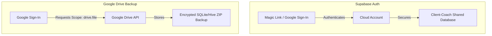

# MacroTracker - Developer Documentation

MacroTracker is a local-first calorie, macro, activity, and nutrition tracking mobile application developed with Flutter. It compiles native applications for both Android and iOS from a single Dart codebase.

---

## 1. High-Level Architecture & Data Flow

The codebase is organized following Clean Architecture principles, ensuring a separation of concerns and making the application highly testable and independent of external frameworks.

```mermaid
graph TD
    subgraph UI Layer
        Widget[Material 3 Widgets] --> |Observes State / Adds Events| Bloc[BLoCs / Cubits]
    end

    subgraph Domain Layer (Pure Dart)
        Bloc --> |Executes| UseCase[Use Cases]
        UseCase --> |Business Entities| Entity[Entities]
    end

    subgraph Data Layer
        UseCase --> |Invokes| Repository[Repositories Interfaces]
        RepositoryImpl[Repositories Implementations] -.-> |Implements| Repository
        RepositoryImpl --> |Reads/Writes| LocalDS[Local Data Sources: Hive / Secure Storage]
        RepositoryImpl --> |Requests| RemoteDS[Remote Services: Supabase / RevenueCat]
    end
```

### Data Flow Example (Logging a Meal):
1.  **UI:** The user clicks "Save Meal" on the `AddMealScreen` widget, which dispatches a `SaveMealEvent` to the `AddMealBloc`.
2.  **Presentation (BLoC):** The bloc processes the event, handles UI-loading states, and calls the `SaveMealUseCase`.
3.  **Domain:** The `SaveMealUseCase` executes the business rules (such as validating portion limits) and calls the `IntakeRepository`.
4.  **Data (Repository):** The `IntakeRepositoryImpl` converts the domain entity into a database object (`IntakeDbo`) and saves it via `HiveDBProvider`. If the user is connected to a professional plan, it schedules a remote sync packet to upload the aggregate daily snapshot to Supabase.

---

## 2. Core Persistence Design: Hive vs. SQLite

MacroTracker uses **Hive** as its primary database instead of SQLite. This choice is based on several architectural benefits:

1.  **Performance:** Hive is written 100% in pure Dart. It stores data as binary payloads in memory (Boxes) with lazy writing to disk. By avoiding the native channel serialization bottleneck required by SQLite plugins (translating from Dart to C/Java/Objective-C), read/write operations are significantly faster.
2.  **NoSQL Object-Oriented Store:** The domain model contains complex hierarchical objects (e.g., a `Meal` contains a list of `Intake` items, each containing a nested `Nutriments` profile and `ServingInfo`). Mapping this structure in relational SQLite tables would require complex join statements and schema boilerplate. In Hive, these nested objects are stored directly as document-like binary payloads.
3.  **Automatic Code Generation:** Data models use Hive annotations (`@HiveType` and `@HiveField`). The code generator (`build_runner`) automatically builds the serializable `TypeAdapter` files, eliminating the need to write custom SQL table migrations or manually parse SQLite result maps.
4.  **Portability:** Hive has zero native binary compilation requirements. This ensures consistent cross-platform behavior across Android, iOS, macOS, and Web without needing platform-specific SQLite binaries.

---

## 3. Codebase Directory Map

```text
lib/
├── core/                       # Shared core infrastructure
│   ├── data/                   # Repositories & database providers
│   ├── domain/                 # Core entities (User, Config) & UseCases
│   ├── presentation/           # Main navigation, themes (HSL palettes), and global components
│   ├── services/               # Background managers (Reminders, RevenueCat, Sentry)
│   └── utils/                  # Secure storage, environment configuration, and constants
└── features/                   # Feature slices (encapsulating UI, BLoC, and UseCases)
    ├── activity_detail/        # Detailed activity logs
    ├── add_meal/               # Meal additions interface
    ├── body_progress/          # Weight & measurement logs and trends
    ├── daily_habits/           # Hydration & daily checklist
    ├── meal_capture/           # AI meal photo and text parsing UI
    ├── onboarding/             # Intro, privacy terms, and theme settings
    ├── professional_plan/      # Client-coach sync views and active plan targets
    ├── recipes/                # Recipe creator and library
    └── settings/               # General configuration, Google Drive settings
```

---

## 4. Backend & Edge Functions (Supabase)

MacroTracker integrates with a Supabase backend for database RLS policies and serverless compute.

### Local Backend Development
The `supabase` directory contains migrations and serverless Deno edge functions. Use the provided PowerShell scripts to run the local emulation stack:
*   **Serve Functions locally:**
    ```powershell
    pwsh ./supabase/serve.functions.ps1
    ```
    Starts the local Supabase edge runtime emulator.
*   **Run Backend Tests:**
    ```powershell
    pwsh ./supabase/test.functions.ps1
    ```
    Executes Deno tests for shared backend logic under `supabase/functions/_shared/`.
*   **Deploy Edge Functions:**
    ```powershell
    pwsh ./supabase/deploy.functions.ps1 -ProjectRef <your-supabase-project-id>
    ```
    Automates deploying all edge functions and sets environment secrets from `supabase/.env.functions`.

### Required Environment Secrets
Edge functions require the following secrets set in your Supabase project:

| Secret Key | Description |
| :--- | :--- |
| `GEMINI_API_KEY` | Gemini Developer API key for meal text/photo parsing. |
| `STRIPE_SECRET_KEY` | Stripe Private Key for billing checkouts. |
| `STRIPE_PRO_WEBHOOK_SECRET` | Stripe webhook signing secret. |
| `STRIPE_PRO_STARTER_PRICE_ID` | Recurring Stripe price ID for B2B Starter plan. |
| `STRIPE_PRO_GROWTH_PRICE_ID` | Recurring Stripe price ID for B2B Growth plan. |
| `STRIPE_PRO_STUDIO_PRICE_ID` | Recurring Stripe price ID for B2B Studio plan. |

---

## 5. Authentication vs. Google Drive Backups

MacroTracker maintains a strict boundary between two distinct OAuth authentication flows:



1.  **Supabase Auth:** Used to authenticate professionals in the web portal and clients accepting invitations. It requests identity-only scopes (email/profile) and manages user identity and Row-Level Security (RLS) policies.
2.  **Google Drive Backup:** Used to store user backups. It requests the restricted `drive.file` scope (granting access only to files created by this application). Backups are stored as encrypted ZIP archives containing database snapshots directly inside the user's private Google Drive. Linking your account in Supabase does *not* grant Drive access, and vice versa.

---

## 6. Local Development Setup

### Installation Steps

1.  **Clone the Repository** and fetch dependencies:
    ```bash
    flutter pub get
    ```

2.  **Configure Environment Variables:**
    Create a `.env` file in the root directory:
    ```ini
    # API Keys
    FDC_API_KEY="your_usda_fdc_api_key"
    SENTRY_DNS="your_sentry_dsn"

    # Supabase backend credentials
    SUPABASE_PROJECT_URL="https://your-project.supabase.co"
    SUPABASE_PROJECT_ANON_KEY="your-anon-key"

    # Google OAuth configurations
    GOOGLE_DRIVE_SERVER_CLIENT_ID="web-client-id.apps.googleusercontent.com"
    GOOGLE_DRIVE_IOS_CLIENT_ID="ios-client-id.apps.googleusercontent.com"
    ```

3.  **Run Code Generation:**
    Generate environment bindings (`env.g.dart`) and database adapters (`*.g.dart`):
    ```bash
    dart run build_runner build --delete-conflicting-outputs
    ```

4.  **Launch the Application:**
    ```bash
    flutter run lib/main.dart
    ```

---

## 7. Platform-Specific Build Configurations

### Android Release Build
*   **Release Signing:** Android builds require signing credentials defined in `android/key.properties` pointing to `epsait-upload-keystore.jks`. Generate these credentials using:
    ```powershell
    pwsh scripts/init-release-signing.ps1
    ```
*   **Google Services:** Place your `google-services.json` config under `android/app/`.
*   **Compile command:**
    ```powershell
    pwsh scripts/build-apk.ps1 -Mode release
    ```

### iOS Release Build
*   **Signing & Provisioning:** Open `ios/Runner.xcworkspace` in Xcode and select your Apple Developer Team (`79AJPC6DP3`) for code-signing.
*   **Google Drive Setup:** Copy `ios/Flutter/GoogleDrive.xcconfig.template` to `ios/Flutter/GoogleDrive.xcconfig` and populate the OAuth client IDs.
*   **Universal Links:** Universal links are declared under Associated Domains in Xcode and mapped in `ios/Runner/Runner.entitlements`.
*   **Compile command:**
    ```bash
    flutter build ipa --release \
      --dart-define=REVENUECAT_IOS_API_KEY=your_key \
      --dart-define=GOOGLE_DRIVE_IOS_CLIENT_ID=your_id \
      --dart-define=GOOGLE_DRIVE_IOS_REVERSED_CLIENT_ID=your_reversed_id \
      --dart-define=GOOGLE_DRIVE_SERVER_CLIENT_ID=your_server_id
    ```

---

## 8. Quality Assurance & Testing

For product-critical changes in monetization, AI request handling, cloud account flows, or Android release readiness, use the repository checks below instead of relying only on broad `flutter test` / `flutter analyze` runs.

*   **Run the minimum readiness ladder:**
    ```powershell
    powershell -ExecutionPolicy Bypass -File .\scripts\check-product-readiness.ps1
    ```
*   **Run only the Android debug build validation:**
    ```powershell
    powershell -ExecutionPolicy Bypass -File .\scripts\check-android-debug.ps1 -SkipPubGet
    ```
*   **See the manual funnel checklist:**
    [`docs/product-validation-checklist.md`](docs/product-validation-checklist.md)

### What the readiness ladder checks

1. `git diff --check`
2. Focused Flutter tests for cloud deletion, monetization, analytics, and AI remote handling
3. Android debug build via Gradle/Flutter integration

### Notes

- `flutter analyze` can still be useful locally, but it is not the primary gate in this checkout until the tooling path is consistently reliable again.
- Android builds may still emit warnings from third-party plugins that have not yet migrated to built-in Kotlin; these warnings are tracked separately from build blockers.
